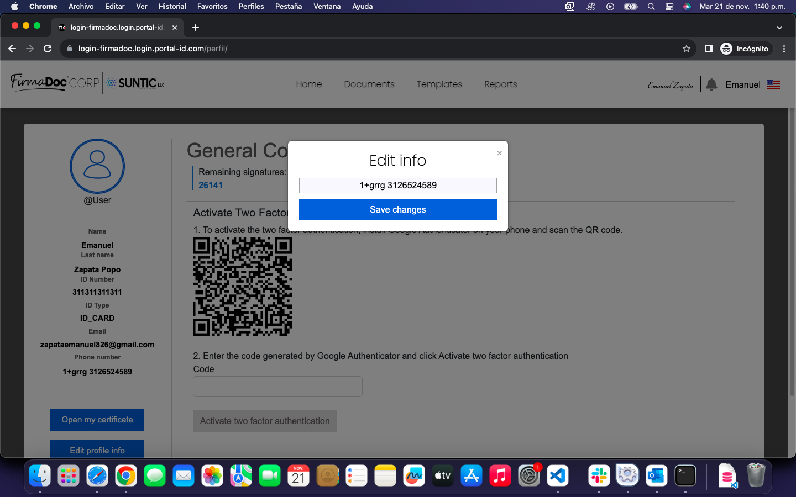

# [Pruebas funcionales](/README.md)

## Instancia firmadocsunticllc

las pruebas se llevaron a cabo en el siguiente dominio [firmadocsunticllc.login.portal-id.com](http://firmadocsunticllc.login.portal-id.com/)

### Registro remitente

- **Prueba:**
  - Satisfactoria :white_check_mark:

- **Observaciones:**
  - El registro se realiza correctamente

### Verificación facial remitente

- **Prueba:**
  - Satisfactoria :white_check_mark:

- **Observaciones:**
  - La verificación facial se realiza correctamente

### Login usuario + contraseña + token Remiten

- **Prueba:**
  - Satisfactoria :white_check_mark:

- **Observaciones:**
  - El inicio de sesión se realiza correctamente

### Cargue de documento y firma por yo

- **Prueba:**
  - Satisfactoria :white_check_mark:

- **Observaciones:**
  - El cargue del documento y firma fueron satisfactorios

### Cargue de documento y firma por otros (validar registro, verificación y login con token de destinatario)

- **Prueba:**
  - Satisfactoria :white_check_mark:

- **Observaciones:**
  - El proceso del cargue y firma del documento se realiza satisfactoriamente

### Cargue de documento y firma por Otros y yo (validar registro, verificación y login con token de destinatario)

- **Prueba:**
  - Satisfactoria :white_check_mark:

- **Observaciones:**
  - El proceso del cargue y firma del documento se realiza satisfactoriamente

### Crear carpeta

- **Prueba:**
  - Satisfactoria :white_check_mark:

- **Observaciones:**
  - La carpeta fue creada satisfactoria mente

### Copiar documentos a Carpeta

- **Prueba:**
  - Satisfactoria :white_check_mark:
  
- **Observaciones:**
  - Solo se copian a la carpeta los documentos en los que soy firmante

### Descargar de certificado de registro perfil de datos

- **Prueba:**
  - Satisfactoria :white_check_mark:

- **Observaciones:**
  - El certificado se descarga correctamente

### Dibujar firmar, cargue de imagen de firma y fuente

- **Prueba:**
  - Satisfactoria :white_check_mark:

- **Observaciones:**
  - La firma dibujada, cargada y de fuente funcionan correctamente

### Usar mínimo 3 plantillas y firmarlas

- **Prueba:**
  - Satisfactoria :white_check_mark:

- **Observaciones:**
  - Actualmente solo hay 2 plantillas Las cuales se firman correctamente

### Editar datos de perfil

- **Prueba:**
  - Incidencia :red_circle:
    

- **Observaciones:**
  - Solo deja editar el numero de teléfono, el campo no tiene validaciones deja guardar cualquier texto.
